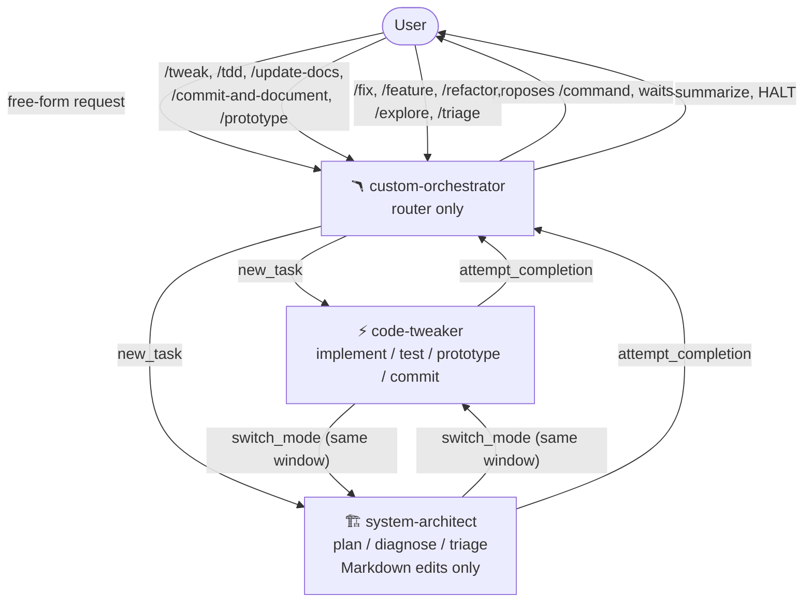

# Zoo Flow

> **Smoke-tested workflow control plane for Zoo Code.**

Zoo Flow is a small, opinionated template that turns [Zoo Code](https://docs.zoocode.dev/)
into a predictable mode + command + skill orchestrator. It defines three
modes, a fixed routing matrix, a command protocol, and path-safety rules.
Drop it into a workspace and your AI assistant stops freelancing.

## Why this exists

Out of the box, AI coding assistants tend to skip planning when you want
planning, plan when you want a tweak, and quietly invent file paths that do
not exist. Adding a pile of skills makes it worse.

Zoo Flow takes a different bet:

- A **router mode** chooses the workflow.
- An **architect mode** plans, diagnoses, and triages — and cannot edit
  source code.
- A **tweaker mode** implements, runs tests, prototypes, and commits — only
  when explicitly approved.
- A small set of **slash commands** acts as the public API between you and
  the modes.
- A few **always-on rules** keep the path layout honest and stop skill paths
  from drifting under `.roo/rules/`.

Everything else is optional. The skills bundled in the template are a
sensible starting point, not the point of the project.

## Why are the folders still named `.roo/`?

Zoo Code keeps compatibility with Roo-style workspace paths. Project
modes still live in `.roomodes`, project slash commands still live in
`.roo/commands/`, and mode-specific rules still live in
`.roo/rules-{mode-slug}/`.

Zoo Flow uses Zoo Code as the primary target, but keeps those `.roo/`
paths because they are the official Zoo Code configuration paths. See
[the Zoo Code docs](https://docs.zoocode.dev/) for the canonical
reference.

Zoo Flow keeps skill discovery in [`docs/skills-index.md`](docs/skills-index.md),
not `.roo/rules/`, so the always-loaded rule set stays small. Zoo Code
loads everything in `.roo/rules/` on every turn, so that folder only
contains rules needed every turn: path safety, the command protocol,
and the manual-reply protocol.

## Core workflow



## Modes

| Slug                  | Name                  | Role                                                       | Edits allowed                                  | Delegation                                  |
| --------------------- | --------------------- | ---------------------------------------------------------- | ---------------------------------------------- | ------------------------------------------- |
| `custom-orchestrator` | 🪃 Custom Orchestrator | Router. Picks workflow, delegates, waits for the user.     | None                                           | `new_task` to architect or tweaker          |
| `system-architect`    | 🏗️ System Architect   | Planning, diagnosis, refactor design, exploration, triage. | Markdown, `.scratch/`, `docs/`                 | `switch_mode` to tweaker in same window     |
| `code-tweaker`        | ⚡ Code Tweaker        | Implementation, TDD, docs updates, prototypes, commits.    | Full repo edits within the assigned command    | `switch_mode` to architect in same window   |

Modes are defined in [`templates/full/.roomodes`](templates/full/.roomodes).
The file is intentionally minimal — each mode's `customInstructions`
points at the matching `.roo/rules-{modeSlug}/` folder, where the actual
behavior lives. See [`docs/mode-rules.md`](docs/mode-rules.md) for the
layout and the rationale.

> Zoo Flow uses the preferred `.roo/rules-{modeSlug}/` directory form
> only. Legacy single-file fallbacks such as `.roorules-{modeSlug}` and
> `.clinerules-{modeSlug}` are not used by this template.

## Commands

The orchestrator's routing matrix only routes the **core workflow
commands**. Helper commands are still part of the template — you can run
them directly in `system-architect` or `code-tweaker` when you need
them. They are intentionally outside the routing matrix so the
orchestrator stays focused on the workflows that benefit from
delegation.

### Core commands (routed by the orchestrator)

| Command                  | Routes to            | What it does                                                |
| ------------------------ | -------------------- | ----------------------------------------------------------- |
| `/tweak`                 | `code-tweaker`       | Direct implementation of small, known changes.              |
| `/tdd`                   | `code-tweaker`       | Test-first implementation loop.                             |
| `/prototype`             | `code-tweaker`       | Throwaway prototype to settle a design uncertainty.         |
| `/update-docs`           | `code-tweaker`       | Reconcile docs with code reality.                           |
| `/commit-and-document`   | `code-tweaker`       | Stage, message, commit, journal — pauses for approval.      |
| `/fix`                   | `system-architect`   | Diagnose → implement → post-mortem chain.                   |
| `/feature`               | `system-architect`   | Sharpen → optional prototype → PRD → issues → TDD chain.    |
| `/refactor`              | `system-architect`   | Plan and stage architecture changes.                        |
| `/explore`               | `system-architect`   | Map unfamiliar code before touching it.                     |
| `/triage`                | `system-architect`   | Clean and prioritize an issue queue.                        |

### Helper commands (run directly when needed)

| Command                          | Best run in          | What it does                                                |
| -------------------------------- | -------------------- | ----------------------------------------------------------- |
| `/diagnose`                      | `system-architect`   | Standalone diagnosis loop with HITL checkpoints.            |
| `/grill-with-docs`               | `system-architect`   | Sharpen a feature spec via QA against current docs.         |
| `/improve-codebase-architecture` | `system-architect`   | Generate a deep architecture review report.                 |
| `/to-prd`                        | `system-architect`   | Turn sharpened context into a PRD.                          |
| `/to-issues`                     | `system-architect`   | Slice a PRD into issues.                                    |
| `/zoom-out`                      | `system-architect`   | Pull back to architectural altitude.                        |
| `/handoff`                       | either               | Produce a clean handoff package for another agent or human. |
| `/grill-me`                      | either               | Adversarial Q&A to sharpen an idea.                         |
| `/caveman`                       | either               | Ultra-compressed communication mode.                        |
| `/write-a-skill`                 | `code-tweaker`       | Author a new skill following the bucket layout.             |
| `/setup-matt-pocock-skills`      | `code-tweaker`       | One-shot setup helper for the bundled skill set.            |

The full routing matrix lives in the orchestrator's `customInstructions`
inside [`templates/full/.roomodes`](templates/full/.roomodes). The command
files themselves live in
[`templates/full/.roo/commands/`](templates/full/.roo/commands).

## Install

Run this from the root of the project where you use Zoo Code:

```bash
npx @fernado03/zoo-flow@latest init
```

If the project already has `.roomodes` or `.roo/`, Zoo Flow will stop
instead of overwriting.

To back up and overwrite existing config:

```bash
npx @fernado03/zoo-flow@latest init --force
```

Zoo Flow installs only the runtime template:

- `.roomodes`
- `.roo/`

It does not copy this repository's `docs/` folder into your project.

After install, reload VS Code:

> Command Palette → **Developer: Reload Window**

Then open Zoo Code, switch to `custom-orchestrator`, and run the smoke
test:

> change a harmless comment in `README`

When choices appear, manually type the number, e.g. `1`. Do not click
suggestions that contain slash commands or mode names. See
[`docs/troubleshooting.md`](docs/troubleshooting.md#clickable-suggestions-can-route-incorrectly).

## Manual install

If you would rather copy the template by hand:

### macOS / Linux

```sh
git clone https://github.com/Fernado03/zoo-flow.git /tmp/zoo-flow
cp /tmp/zoo-flow/templates/full/.roomodes .
cp -R /tmp/zoo-flow/templates/full/.roo .
```

### Windows (PowerShell)

```powershell
git clone https://github.com/Fernado03/zoo-flow.git C:\Temp\zoo-flow
Copy-Item C:\Temp\zoo-flow\templates\full\.roomodes .
Copy-Item -Recurse C:\Temp\zoo-flow\templates\full\.roo .
```

After copying:

1. Open the project in an editor running Zoo Code.
2. Confirm the three custom modes appear: `🪃 Custom Orchestrator`,
   `🏗️ System Architect`, `⚡ Code Tweaker`.
3. Switch to `custom-orchestrator` and start a new task.

If a slash command does not run, see
[`docs/troubleshooting.md`](docs/troubleshooting.md).

## Smoke tests

The repo ships a fixed set of smoke tests in
[`docs/smoke-tests.md`](docs/smoke-tests.md). They are short scripts you can
run by hand inside Zoo Code to verify routing, mode boundaries,
and skill loading. The first one — README tweak with no slash command —
takes about a minute.

When the orchestrator asks which workflow to use, **type the number
manually**, for example `1`. Do not click suggestions that contain slash
commands or mode names — clicking them can route incorrectly. See
[`docs/troubleshooting.md`](docs/troubleshooting.md#clickable-suggestions-can-route-incorrectly).

Example choice list:

```text
1. /tweak — small known implementation change
2. /update-docs — documentation-focused change
3. Hold — I will specify more detail

Reply by typing only the number, e.g. 1.
```

Worked examples for the most common flows live in
[`examples/`](examples/):

- [`tweak-smoke-test.md`](examples/tweak-smoke-test.md)
- [`fix-flow.md`](examples/fix-flow.md)
- [`feature-flow.md`](examples/feature-flow.md)

## Screenshots

Screenshots and short clips of the orchestrator routing, the architect
hand-off, and the tweaker running a slash command will land in
[`assets/`](assets/) before the first tagged release.

## Roadmap

- `templates/minimal/` — a stripped-down template with only the three modes,
  the path-safety rules, and `/tweak` + `/fix`.
- Optional CI workflow that runs the smoke-test JSON validation on every
  PR.
- A short demo video in `assets/`.
- ADRs covering the three-mode split, the routing matrix, and the
  path-safety choice.
- Guidance on integrating Zoo Flow alongside other workflow tools.

## How this is different

Zoo Flow is not a methodology and it is not a giant skills pack. It is a
**Zoo-native control plane**: a thin layer that turns three modes,
a routing matrix, and a path-safety contract into a predictable workflow.

For a longer comparison with adjacent projects, see
[`docs/comparison.md`](docs/comparison.md).

## Migration note

Zoo Flow started as a Roo Flow template and was renamed for Zoo Code.
The `.roo/` folder names are intentionally preserved because Zoo Code
still uses those paths for project modes, commands, rules, and skills.
If you are migrating from a Roo Code workspace, copying the same
`.roo/` directory and `.roomodes` file into a Zoo Code workspace is
expected to keep working.

## Inspiration

This project was inspired by Matt Pocock's agent-skills workflow ideas
and his emphasis on small, composable, task-focused skills for coding
agents.

Zoo Flow is not affiliated with, endorsed by, or maintained by Matt
Pocock. It is an independent Zoo Code workflow-control template
focused on custom modes, delegation, command routing, and smoke-tested
agent workflows.

## License

[MIT](LICENSE).
