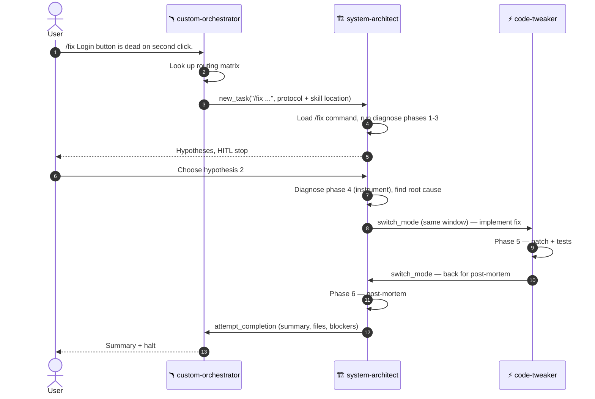
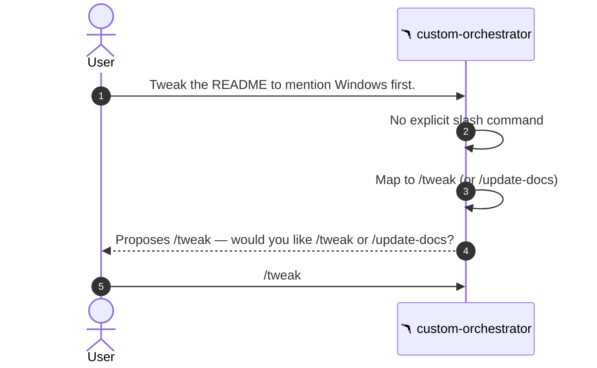

# Command flow

This document walks the lifecycle of a slash command from chat input to
completion, and shows the difference between same-window switches and
delegated subtasks.

## End-to-end: explicit slash command

Notes:

- Step 3 is the only `new_task` in the flow. The orchestrator never uses
  `switch_mode`.
- Steps 7 and 9 are `switch_mode` calls in the **same task window**.
  Context is preserved across them.
- Step 11 is `attempt_completion`. It returns to the orchestrator, which
  then halts in step 12.

## End-to-end: free-form request

After step 5 the flow continues exactly like the explicit case above.

## Same-window vs delegated

| Primitive            | Used by                         | When                                          | Cost      | Context     |
| -------------------- | ------------------------------- | --------------------------------------------- | --------- | ----------- |
| `switch_mode`        | architect ↔ tweaker             | Tight loop inside one workflow                | Cheap     | Preserved   |
| `new_task`           | orchestrator → architect / tweaker | Top-level delegation of a workflow         | Expensive | Fresh       |
| `attempt_completion` | architect / tweaker → orchestrator | End of a delegated subtask                | Free      | Returns up  |

The orchestrator only uses `new_task`. Modes only use `switch_mode` and
`attempt_completion`. Crossing those wires is a bug.

## Phase chains

Some commands are single-skill (`/tweak`, `/prototype`). Others chain
phases across modes. The two non-trivial chains are `/fix` and `/feature`.

### `/fix` chain

| Phase | Mode      | Action                                          | Hard stop?        |
| ----- | --------- | ----------------------------------------------- | ----------------- |
| 1     | Architect | Diagnose phases 1–3, propose hypotheses         | Yes — pick one    |
| 2     | Architect | Diagnose phase 4, instrument chosen hypothesis  | No                |
| 3     | Tweaker   | Implement fix, add/extend tests                 | No                |
| 4     | Architect | Post-mortem; suggest `/refactor` if rot found   | No                |
| 5     | Tweaker   | Suggest `/commit-and-document`                  | Yes — git approval|

### `/feature` chain

| Phase | Mode      | Action                                              | Hard stop?                  |
| ----- | --------- | --------------------------------------------------- | --------------------------- |
| 1     | Architect | Sharpen via `grill-with-docs`; update docs          | Yes — Prototype or skip?    |
| 2a    | Tweaker   | Prototype via `/prototype` (only if user picks it)  | Yes — verdict on prototype  |
| 3     | Architect | Build PRD via `to-prd`                              | Yes — ready to slice?       |
| 4     | Architect | Slice into issues via `to-issues`                   | Yes — approve issue list    |
| 5     | Tweaker   | For each issue, run `/tdd`; suggest commit          | Yes — git approval per issue|

Hard stops are not optional. Removing them is the fastest way to make the
flow unsafe.

## What the delegated message looks like

When the orchestrator hands work to a mode, the `new_task` message
contains, at minimum:

- `/{command}` — the slash form, so it is greppable in chat.
- `{command}` — the normalized name, so the receiving mode can hand it
  to `run_slash_command`.
- The user context.
- A reminder to follow `templates/full/.roo/rules/01-command-protocol.md`.
- A reminder that skills are at `.roo/skills/...`.
- A completion rule: end with `attempt_completion` containing summary,
  files inspected/changed, commands/tests run, blockers, and a
  recommended next command.

This template is enforced by the orchestrator's `customInstructions` (rule
5 in `.roomodes`).
