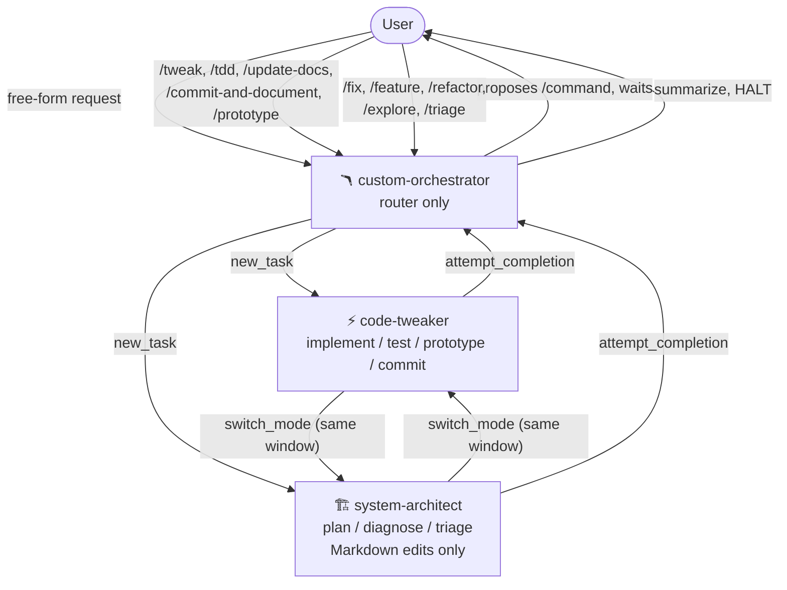

# Overview

Zoo Flow is a small, opinionated template that turns
[Zoo Code](https://docs.zoocode.dev/) into a predictable mode +
command + skill orchestrator. It defines three modes, a fixed routing
matrix, a command protocol, and path-safety rules. Drop it into a
workspace and your AI assistant stops freelancing.

## Why this exists

Out of the box, AI coding assistants tend to skip planning when you
want planning, plan when you want a tweak, and quietly invent file
paths that do not exist. Adding a pile of skills makes it worse.

Zoo Flow takes a different bet:

- A **router mode** chooses the workflow.
- An **architect mode** plans, diagnoses, and triages — and cannot
  edit source code.
- A **tweaker mode** implements, runs tests, prototypes, and commits —
  only when explicitly approved.
- A small set of **slash commands** acts as the public API between
  you and the modes.
- A few **always-on rules** keep the path layout honest and stop
  skill paths from drifting under `.roo/rules/`.

Everything else is optional. The skills bundled in the template are a
sensible starting point, not the point of the project.

## Core workflow

For the deeper "why", see [`philosophy.md`](philosophy.md). For the
component-level reference, see [`architecture.md`](architecture.md).
